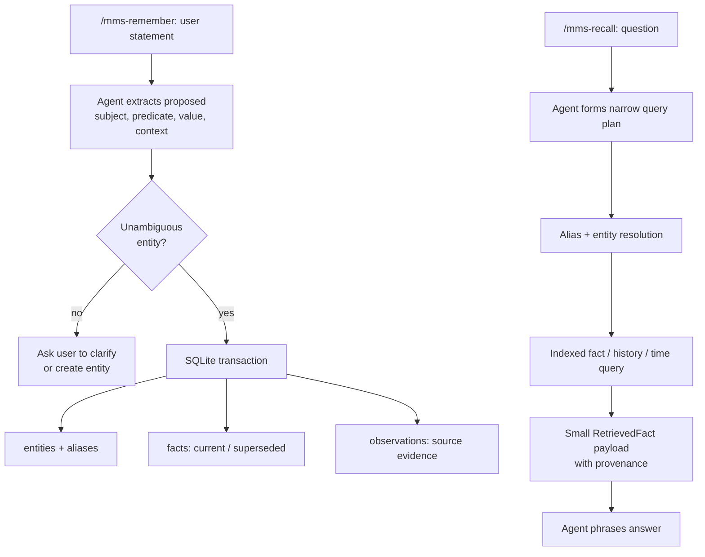

# ADR 0001: Local deterministic fact memory

- Status: Accepted
- Date: 2026-08-02
- Decision owners: Personal AI Memory Engine maintainers

## Context

The project is a persistent memory layer for one user's AI assistant, not a note app, document store, or general RAG system. Its expected scale is 1,000–10,000 active facts over years. The important operations are exact current-state lookup, historical lookup, explicit updates, explainability, easy backup, low latency, and minimal LLM context.

Facts evolve: an employer, address, diet, preference, or relationship may change. A future implementation must retain enough provenance and validity data to explain both the current answer and the historical timeline.

## Decision

Use a local SQLite database as the authoritative fact store. Model the world as stable entities plus time-bounded facts. Resolve aliases deterministically before lookup; retrieve by entity/predicate/index; use an LLM only to propose a typed write/query or to phrase a result.

Keep old facts. A changed fact in the same logical slot—`subject + predicate + context_key`—supersedes the previous `current` fact in one transaction and closes its validity interval. A repeated assertion adds an observation rather than a duplicate fact. Archival hides a fact without deleting it; permanent forgetting removes one exact fact and its observations only after explicit confirmation.



## Consequences

### Positive

- Current facts are deterministic indexed reads rather than semantic similarity results.
- SQLite provides ACID writes, WAL-based concurrent-write serialization, portable one-file backup, and no server dependency.
- The data model contains provenance, confidence, status, validity time, and supersession links, so answers are explainable and migratable.
- Exact retrieval passes only relevant structured records to the LLM, minimizing context use.
- Entity resolution fails on ambiguity rather than silently inventing duplicate identities.

### Trade-offs

- Natural-language interpretation is still model-dependent. The database is deterministic only after a write/query has been correctly structured.
- The current rule planner recognizes only a few query phrasings; unknown phrasing must be converted to an explicit typed plan or clarified.
- This design does not provide semantic recall, automatic capture from arbitrary conversations, or deep graph traversal.
- Updates are preserved rather than deleted, so the database grows with historical records. That is intentional at this scale.

## Alternatives considered

| Alternative | Decision |
|---|---|
| JSON/YAML files | Rejected: easy to inspect but would require custom indexing, atomic updates, and consistency logic. |
| Vector/RAG memory (for example, Mem0 as the source of truth) | Rejected: useful for fuzzy conversational recall but not deterministic enough or token-efficient enough for authoritative facts. |
| Graph database | Deferred: relationships are represented through `object_entity_id`; a graph server is unjustified at the current scale. |
| Append-only event store | Partially adopted: fact and observation history provide auditability without a separate projection system. |

## Implementation map

| Responsibility | Authoritative implementation | Location |
|---|---|---|
| Public models | `Entity`, `FactInput`, `RetrievedFact` | `memory_engine/models.py` |
| Storage, schema, transactions, indexes | `SQLiteStore` | `memory_engine/storage.py` |
| Deterministic alias resolution | `EntityResolver` | `memory_engine/resolution.py` |
| Ingest, lifecycle, retrieval, rule planner | `MemoryEngine` | `memory_engine/engine.py` |
| Optional type/predicate vocabulary | `Ontology` | `memory_engine/ontology.py` |
| Tests and benchmark | unittest / stdlib benchmark | `tests/`, `benchmarks/` |
| Hermes runtime | Standalone CLI used by skills | `skills/mms-memory-engine/scripts/memory.py` |
| Hermes entry points | `/mms-remember`, `/mms-recall`, `/mms-correct`, `/mms-archive`, `/mms-forget` instructions | `skills/mms-*/` |

## Future-agent handoff

Start by reading this ADR, then [architecture.md](../architecture.md), followed by the test suite. Run the tests before changing behavior:

```sh
python3 -m unittest discover -s tests -v
python3 benchmarks/benchmark.py
```

### Invariants to preserve

1. Do not use semantic retrieval as the default path for authoritative facts.
2. Never silently select an entity when aliases match multiple active entities.
3. A fact update must atomically supersede the prior current fact and preserve its historical validity interval.
4. A duplicate assertion must not create another current fact.
5. Retrieval output must retain source, confidence, timestamps, status, and a reason for matching.
6. Keep the SQLite schema migration-friendly and make export/import possible before any incompatible change.
7. Treat archive and forget as separate operations: archive is reversible history retention; forget is confirmation-gated permanent removal of one displayed fact.

### Known gap: two runtimes

`memory_engine/` is the richer reference implementation. The Hermes CLI at `skills/mms-memory-engine/scripts/memory.py` is intentionally standalone and therefore a smaller duplicate implementation. It currently lacks object-entity relationship edges, tags, raw-text observations, ontology support, proactive alias-collision rejection at write time, and the richer `answer()` planner.

Do not improve one runtime and assume the other inherits the change. The preferred next refactor is to package `memory_engine` for installation with the skill or generate the CLI from shared code, then add parity tests. Until then, treat the standalone Hermes runtime as the production path used by `/mms-remember` and `/mms-recall`.

### Prioritized improvement path

1. Add schema versioning, migrations, JSONL export/import, and backup/restore commands.
2. Add a write-preview/confirmation protocol for important facts: display the proposed subject, predicate, value, context, and superseded fact before commit.
3. Bring Hermes CLI parity with entity relationship support and alias-collision checks; add contract tests shared with `memory_engine`.
4. Replace the narrow natural-language planner with a validated structured-intent layer. It may use an LLM to propose JSON, but must validate entities, predicates, type, and context before executing.
5. Add optional semantic/episodic memory only as a candidate generator. Confirm/promote any fact into SQLite before treating it as authoritative.

### Change checklist

- Add tests that establish the intended behavior before altering schema/query logic.
- Preserve backward compatibility or ship a tested migration and export fallback.
- Update this ADR only when a decision changes; update `architecture.md` for implementation detail.
- Benchmark a representative operation if altering indexes, schema, or retrieval flow.
- Update both the workspace skill source and the installed Hermes copy at `~/.hermes/skills/` when changing skill files.
