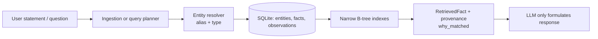

# Architecture: Personal AI Memory Engine

## Decision

The implementation uses a single local SQLite database with a normalized entity table, append-preserved fact rows, and explicit B-tree indexes. SQLite is the smallest practical durable choice for 1,000–10,000 active facts: it is transactional, portable as one backupable file, supports temporal SQL, needs no server, and makes current lookups index seeks. The LLM is intentionally outside retrieval: it can extract a proposed `FactInput` or phrase returned facts, but it is not asked to search memory.



## Candidate architectures

| Approach | Strengths | Why not selected |
|---|---|---|
| Filesystem JSON/YAML | Human-readable and easy to copy | Atomic updates, uniqueness, temporal filtering, and index repair become application code. |
| Key-value store | Fast direct keys | Relationships, time ranges, aliases, and multiple indexes require manual secondary-index consistency. |
| Graph database | Natural traversal | Extra server/runtime and query language add complexity for a personal graph of this size. |
| Append-only event log | Excellent audit history | Materializing current state and handling correction queries adds another storage layer. |
| **SQLite relational hybrid** | ACID, portable, SQL time queries, declarative indexes, simple backups | Selected. Facts retain event-like history through `supersedes_id` and observations. |

An optional future semantic index may only return candidate entity/fact IDs, then must be verified by deterministic filters. It is deliberately absent from the default planner.

## Data model

`entities` holds stable UUIDs, a canonical name, lightweight type, and a merge pointer. The `Ontology` registry provides optional familiar types/predicate descriptions, but storage accepts any type/predicate string; new vocabulary requires no migration. `aliases` maps normalized names, pronouns, identifiers, and user labels to entities. An identifier can be represented as a typed fact (for example `passport_serial`) or alias where it is a safe entity key.

`facts` represents a subject + predicate + JSON value or object-entity relationship. `context_key` identifies its logical slot: `Me / employed_by / default` has exactly one current assertion in normal ingestion. Facts carry confidence, source, observation time, validity interval, tags, status, and the fact they supersede. `observations` retain multiple pieces of evidence for an identical assertion without duplicating its current fact.

Lifecycle: raw ingestion creates `current` in this compact implementation; clients that require review can use `set_lifecycle` for `observed`, `validated`, promotion to `current`, or `archived`. `correct()`/`remember()` replace a value by atomically marking the old current fact `superseded`, setting `valid_to`, and inserting a new `current` fact. `archive()` retains a fact but excludes it from normal lookup. `forget()` permanently removes one exact fact and its observations; its caller must obtain explicit user confirmation first. No information is deleted by an ordinary update.

## Entity resolution and ambiguity

Names are normalized with Unicode NFKC, case folding, whitespace collapsing, then matched through canonical names and aliases. A match is deterministic when it has one active entity; a type can disambiguate (e.g. a person and pet both named Tommy). Multiple matches raise `AmbiguousEntityError`; no arbitrary score or silent duplicate is used. New entity creation enforces canonical-name/type uniqueness; aliases cannot be assigned across entities. A production conversational layer should ask the user to select or merge candidates when that error occurs.

## Query planning and indexes

The explicit API is the canonical deterministic planner:

- `lookup(entity, predicate)` uses `ix_fact_current(subject_id, predicate, context_key, status)`.
- `related_to(entity, predicate)` uses `ix_fact_object` for reverse relationships.
- `history(entity, predicate)` uses the subject/predicate index and returns the timeline.
- `lookup(..., at=time)` and `changed_between` use time indexes plus a validity filter.
- alias resolution uses `ix_alias_lookup` and canonical-name lookup uses `ix_entity_name`.

`answer()` is deliberately a narrow rule planner for familiar phrasings and fails closed when it cannot form an exact plan. A higher layer can map an LLM-produced typed intent to the same API; it should validate entity IDs/predicates before executing. Each result includes source, timestamps, confidence, status, supersession linkage (in storage), and `why_matched`.

## Public components

`SQLiteStore` owns transactions/schema/index rebuilds. `EntityResolver` owns name matching. `MemoryEngine` is the storage, ingest, query-plan, and retrieval facade. `FactInput` and `RetrievedFact` are stable public data objects. This separation makes a different persistence backend or intent parser replaceable without changing callers.

## Correctness and operational notes

Writes use `BEGIN IMMEDIATE`, foreign keys, WAL mode, and a busy timeout: concurrent writers serialize rather than interleave an update/supersession. Backup is a consistent SQLite backup (or copy while the app is closed). Indexes are rebuildable using `REINDEX`. Sensitive values such as serial numbers are intentionally stored verbatim; encrypt the database at rest through OS full-disk encryption or a future encrypted SQLite backend.

## Correction, archival, and deletion

- **Correct:** write the replacement value into the same subject/predicate/context slot. The old current fact becomes superseded and remains in history.
- **Archive:** set a specific fact to `archived`. It is hidden from ordinary current retrieval but remains in historical queries.
- **Forget:** permanently delete one identified fact and its observations. It clears any later fact's `supersedes_id` reference before deletion so remaining history remains valid. It does not delete backups, exports, Git history, or copies on another device.

The Hermes slash skills mirror this model: `/mms-correct` is an explicit update; `/mms-archive` first displays a fact and requires `ARCHIVE <fact-id>`; `/mms-forget` requires `DELETE <fact-id>`. The command-line runtime additionally requires `--confirm ARCHIVE` or `--confirm DELETE`, preventing accidental destructive execution.

## Complexity and expected performance

At this scale, entity/alias lookup and current-slot lookups are `O(log n + k)` with tiny `k`; insert/update is `O(log n)` per maintained index; history and temporal queries are `O(log n + k)` where `k` is returned facts; `REINDEX` is `O(n log n)`. The included benchmark creates 10,000 facts, performs 1,000 lookups/updates, checks history, and rebuilds indexes. It reports local elapsed times rather than misleading fixed latency claims.

## Testing

`tests/test_engine.py` covers alias resolution, ambiguous names, duplicate assertion observations, corrections, archival, permanent deletion, supersession, historical and point-in-time lookup, relationship traversal, temporal changes, persistence/index rebuild, and concurrent writes. Run:

```sh
python -m unittest discover -s tests -v
python benchmarks/benchmark.py
```
